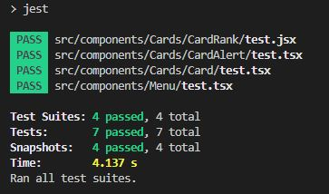
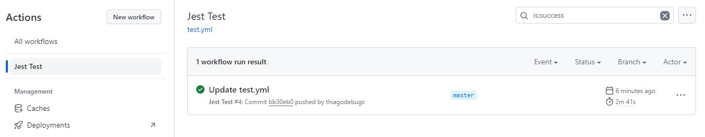
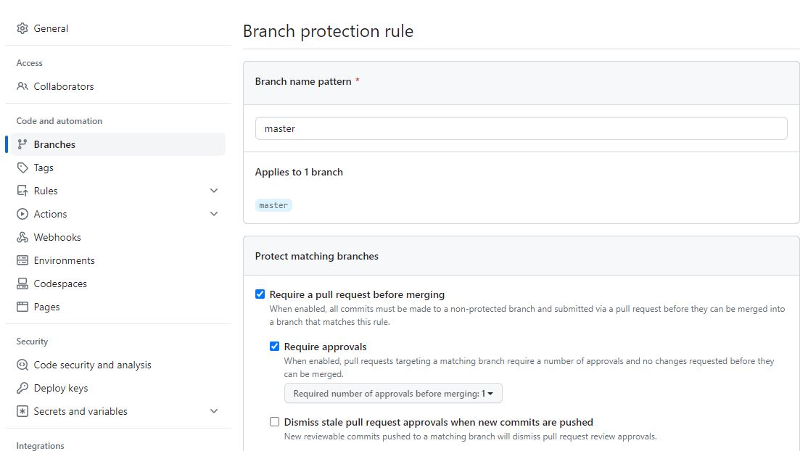

#  

## Sobre o projeto

Bem vindo ao projeto Brainforge.

Para visualizar o projeto, acesse: [Brainforge](https://brainforge.posy.com.br/)

Este projeto foi desenvolvido para como um desafio. O objetivo erar criar uma página do Brainforge, uma plataforma de ensino gamificada, utilizando Next.js.

## Tecnologias utilizadas

- [Next.js](https://nextjs.org/)
- [React.js](https://pt-br.reactjs.org/)
- [TailwindCSS](https://tailwindcss.com/)
- [Material Design Icons](https://materialdesignicons.com/)
- [TypeScript](https://www.typescriptlang.org/)
- [Jest](https://jestjs.io/pt-BR/)
- [Testing Library](https://testing-library.com/)

## Diferenciais

- [x] Responsividade

  - Garantindo uma plataforma que se adapte a diferentes dispositivos, proporcionando uma experiência consistente e amigável para usuários em desktops, tablets e smartphones.

- [x] Testes unitários

  - Testes unitários com Jest e Testing Library. Os testes unitários são essenciais em projetos de grande porte, pois identificam problemas precocemente, facilitam refatoração, tornam a manutenção mais fácil e asseguram a confiabilidade do código.

  - 

- [x] CI (Integração Contínua)

  - A integração contínua é uma prática de desenvolvimento de software que consiste em fazer integrações do código em um repositório compartilhado. A cada push na branch master, o código é testado e, se não aprovado nos testes, o deploy não é realizado.

  - 

- [x] Proteção da branch master

  - Restringir o acesso, impor revisões de código e aplicar testes antes de mesclar alterações ajuda a manter a integridade do projeto e evita introdução de erros críticos na branch principal.

  - 

- [x] Deploy na Vercel
  - A Vercel é uma plataforma de hospedagem de sites e aplicativos que permite fazer deploy de forma simples e rápida. Além disso, ela oferece integração com o GitHub, o que permite automatizar o deploy a cada push na branch master.
